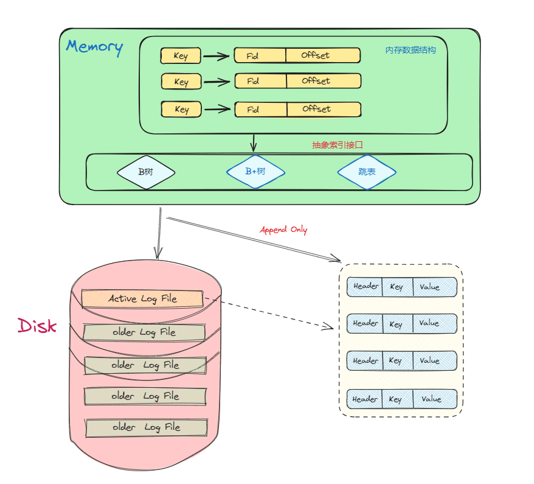

## KV存储引擎/数据库

KV存储是一种基于键值的存储方式，key是唯一的标识符，值是与这个key相关联的数据，KV存储的场景比较广泛，既可以用于数据库的中间缓存层、底层存储系统，也可以用于数据访问接口。
它与Redis的区别？
Redis是一种基于内存的数据库，本质上是面向内存设计的，并不能保证数据的持久性，我们这里的KV存储一般是面向磁盘的，数据的持久性能够得到保证，并且配合适当的设计，性能并不输Redis。

一般来说KV数据库的数据组织模型大致分为两类，可变存储结构与不可变存储结构：
**可变存储结构**的代表性数据结构是 `B+树`，这种可变存储结构使用”原地更新“的机制，在插入删除更新数据时，数据记录直接在目标文件原本的位置被更新；B+ 树比较有代表性的项目有 etcd 的存储引擎 `BoltDB`。
**不可变存储结构**的代表是 `LSM树`，它使用 AppendOnly 的方式来实现顺序写操作，充分的利用顺序I/O，避免在修改期间对页数据进行重写。其中较为知名的项目有 `LevelDB`、`RocksDB`。
本文的 `Bitcask` 存储模型的实现更偏向LSM存储结构。

## Bitcask存储模型

论文地址： https://riak.com/assets/bitcaskintro.pdf
`Bitcask` 是 [Riak](https://riak.com/index.html) 中使用的存储引擎之一，它是一个无序的日志结构存储引擎，与 LSM 不同的是，它不适用 `memtable` 进行缓冲，而是将数据记录直接存储在日志文件中。为了使得value 可被搜索，Bitcask 使用一种名为 `keydir` 的内存数据结构，它保存着与key对应的最新的数据记录的引用，旧的数据记录可能仍然保存在磁盘中，但不会被 keydir 引用，并且它们会在 `Merge` 过程中被”垃圾回收“，在 Bitcask 论文中 keydir 被实现为内存中的哈希表，并在 Bitcask 启动期间从日志文件中重建，本质上是对磁盘数据建立索引。基于 `Appendonly` 的日志文件构建 KV 存储似乎是一个非常奇怪的设计选择，但 Bitcask 不仅提高了效率，而且还提供了非常高的读写吞吐量。

## 内存设计

内存中我们做的事情主要是对磁盘文件中的数据建立索引，我们需要选择一种支持高效插入、读取、删除的索引结构，并且如果需要数据的高效遍历的场景，那最好选择天然支持有序的数据结构。
符合这种需求的数据结构有 `BTree` 、 `SkipList` 、 `红黑树` 等，本项目旨在快速实现一个可用的 KV 数据库，并且尽可能保证简单性，所以没有选择自己去实现一种索引结构，而是选择现成开源库进行封装，目前本项目支持两种索引结构，分别是 `BTree`、 `B+Tree`。

Bitcask的内存索引结构的选择比较多样化，我们可以根据自己的需求进行设计，本项目提供了一个通用的抽象接口，支持介入不同的索引结构，在设计上更加灵活，如果需要添加新的索引结构，仅仅需要实现通用接口的方法，并在启动前通过配置项选择即可。

以 `BTree` 为例， 在本项目的实现中，它的节点中保存的是一种名为 `Item`的结构体，Item 中包含了一个 `key` 和一个 `LogRecordPos` 的指针，其中 LogRecordPos 描述了数据记录在磁盘中的位置 (文件ID + 偏移量 )。
本项目的通用索引接口实现： https://github.com/SLOWDOWNO/go-bitcask/blob/main/index/index.go

## 磁盘设计

对于磁盘设计，我们需要考虑的是如何将数据记录写入磁盘，我的做法是将 Golang 的标准文件操作 API 进行简单的封装，然后数据在磁盘上的读写使用这些标准的文件 API 进行。类似于内存索引的设计，本项目定义了一个 `IOManager` 接口， 将 IO 操作进行抽象，方便后续介入不同的 IO 类型，目前本项目支持的 IO 有标准文件 IO 以及 `mmap` ，其中 `mmap` 仅用于启动 Bitcask 存储引擎时的读磁盘数据进行索引建立，这样做省去了从内核态到用户态的内存拷贝操作，大大加快了索引的建立过程。

如论文所述，一个 Bitcask 实例是系统上的一个目录，并且限制同一时刻有且仅有一个进程打开这个目录，目录中有多个`数据文件` ，但同一时刻只有一个 `活跃文件` 用于写入新的数据，当活跃文件写入到一定阈值后，会被关闭成为旧的数据文件，并且打开一个新的数据文件用于写入，这样看下来，这个目录就是一个活跃文件和许多旧的数据文件的集合。

## 文件格式

文件格式的实现在 https://github.com/SLOWDOWNO/go-bitcask/tree/main/data 下

在本项目中，当我们向 Bitcask 写入一条数据时，实际上写入的是一个名为 `LogRecord` 的结构体：

```go
type LogRecord struct {
	Key   []byte
	Value []byte
	Type  LogRecordType
}
```

除此之外它还包含一个头部，其中保存了一些数据记录的 `meta data` ：

```go
type logRecordHeader struct {
	crc        uint32        // crc 校验码
	recordType LogRecordType // LogRecord 类型
	keySize    uint32        // key 长度
	valueSize  uint32        // value 长度
}
```

内存索引中保存的数据索引：

```go
type LogRecordPos struct {
	Fid    uint32 // 文件id， 标识数据在哪个文件
	Offset int64  // 偏移量，数据在数据文件中的位置
}
```

数据文件：

```go
type DataFile struct {
	FileId    uint32        // 文件 id
	WriteOff  int64         // 文件写到哪个位置
	IoManager fio.IOManager // io 读写管理
}
```

## Bitcask 整体架构



## Bitcask 读写数据

### 写数据

Bitcask 写数据总体分为两部， 先写磁盘文件，再更新内存索引。
首先将数据记录封装到`LogRecord` 结构体中，然后追加写入到当前的 `活跃文件` 中，需要注意的是，在日志结构存储的存储引擎中。删除数据也是通过追加写来进行的，在 `LogRecord` 中除了 key、value，还有一个 `Type` 字段，在删除数据时将其设置为 `LogRecordDelete` 这样一个“墓碑值”来表示对应 key 的数据已被删除。
写数据流程的伪代码描述大致逻辑：

```go
func (db *DB) appendLogRecord(logRecord *data.LogRecord) (*data.LogRecordPos, error) {

  if 活跃文件 == nil {
    initActiveFile() // 初始化活跃文件
  }

  if 活跃文件 > 文件阈值 {
    Sync 活跃文件()
    OpenNewActiveFile() // 打开新的活跃文件
  }

  Write(EncodeLogRecord) // 写入编码后的数据记录

  return LogRecordPos // 返回索引信息
}
```

这里有一个细节，就是在写入编码后的数据记录之前要先记录 当前的 `Offset` ，我们需要在构造索引时返回这个 `offset` ，便于索引访问时快速定位查找。
当更新索引信息后，写数据流程至此结束。

### 读数据

Bitcask的读数据也非常简单，首先根据用户传入的 `key` 去内存中的索引中查找数据，如果索引中没找到，说明这条数据记录根本不存在(Bitcask的所有key都会在启动时加载到内存中)，此时返回一个 `ErrKeyNotFound`。

如果在索引中根据 `key` 找到了对应的 `LogRecordPos`, 那么会根据其中的 `FileId` 字段去判断对应的数据文件是不是`活跃文件`，如果是直接用活跃文件，如果不是，就去 `oldFiles` 中找，这时有可能出现数据文件为空的情况，那么会返回 `ErrDataFileNotFound` 表示文件没找到。

如果找到`数据记录`所在的`数据文件`，此时就可以通过 `Offset` 读处数据并返回， 如果数据已经被标记删除，会返回一个 `ErrKeyNotFound`。

读写流程的实现见 `db.go` 中的 Put、Get函数： https://github.com/SLOWDOWNO/go-bitcask/blob/main/db.go

## Bitcask 启动！

Bitcask 启动主要分为两步，一是加载目录中的数据文件，打开每个文件的文件描述符，二是遍历数据文件中的内容，构建内存索引。

实现打开存储引擎的 `Open( )` 函数会接收用户传递的配置项 `Option` ：

```go
type Options struct {
	// 数据库存放数据的目录
	DirPath string

	// 数据文件的大小
	DataFileSize int64

	// 内存索引类型
	IndexType IndexerType

	// 每次写数据是否持久化
	SyncWrite bool

	// 累计写到一定阈值再进行持久化
	BytesPerSync uint

	// 启动时是否需要以 mmap 的方式加载
	MMapAtStartup bool
}
```

Bitcask 会对这些配置项进行校验，避免用户传入无效的配置项，执行未定义的行为。校验完成后，查看该目录 `DirPath` 是否存在，如果不存在说明是第一次在本目录启动 Bitcask 实例，此时需要先创建这个目录。

对于论文中所述的同一时刻只能有一个进程使用 Bitcask 实例，本项目使用别人写好的文件锁 libary 来实现： https://github.com/gofrs/flock 。逻辑很简单，在打开目录的是否进行判断，尝试获取一把文件锁，如果不能获取到 `文件锁` 的话，说明已经有另一个进程在使用 Bitcask 实例了，直接 retuen 一个 `ErrDatabaseIsUsing`。

成功获取文件锁后，我们会初始化 `DB` 结构体：

```go
type DB struct {
	options     Options
	mu          *sync.RWMutex
	fileIds     []int                     // 文件id只能在加载索引的时候使用
	activeFile  *data.DataFile            // 当前唯一的活跃数据文件
	oldFiles    map[uint32]*data.DataFile // 旧的数据文件
	index       index.Indexer             // 内存索引
	seqNo       uint64                    // 事务序列号， 全局递增
	isMerging   bool                      // 是否正在 merge
	fileLock    *flock.Flock              // 文件锁, 保证多进程之间的互斥
	bytesWrites uint                      // 累计写了多少个字节 用于持久化策略
}
```

接着 Bitcask 加载数据文件，这部分逻辑在 `loadDataFiles` 函数中，首先打开配置项中的数据目录 `DirPath` ， 如果这个目录下没有文件，说明该数据库为空，我们直接返回。否则加载这个目录下的数据文件，本项目 Bitcask 的数据文件定义了一个统一扩展名为：\*.data，所以我们遍历找出所有以 `.data` 为结尾的文件，对它们的 `文件Id` 进行排序，接着遍历每个文件Id，打开对应的数据文件，并标记活跃文件，活跃文件的Id最大，非常好判断。

最后一个流程是加载索引，Bitcask 会依次从小到大遍历每个文件Id，对应的逻辑是将数据文件从旧到新进行加载，因为数据时追加写入的，最新的数据在更靠前的位置。由于在上一个加载数据文件的过程中已经对文件Id排序进行了保存，所以在这个流程中只需要循环遍历数据文件中的所有数据记录，在这个过程中本项目定义了一个 `Offset` 变量，来表示当前读取到文件的哪个位置，然后直接调用 `DataFile` 中的函数拿到 `LogRecord` 信息，最后根据当前遍历的文件Id，以及 offset 信息，构造出索引结构中需要的结构 `LogRecordPos` 并将它存储在内存索引中，至此流程结束。

## 事务的简单实现——WriteBach

数据库事务的基本属性 `ACID` 相信大家都不陌生， 基础概念本文不做过多介绍，主要讲一讲在这个简单的存储引擎中如何实现基本的事务。
Bitcask 存储引擎的设计有一个很大的特点是，我们将所有的 key 维护在内存中，如果再次基础上实现 `MVCC` 那么也会在内存中去维护所有的 key、位置索引、版本信息，这会造成内存容量的膨胀。(其实是本人没写出来...

本项目实现了一种简单的事务，使用一把全局锁保证传行化，实现简单的满足ACID的事务。

### 如何实现一个批量写操作的原子性？

为了达到目标：一个批量操作要么全部成功，要么全部失败回滚，不会存在中间状态，造成数据不一致。我们可以先将用户的批量操作缓存起来，保存到一个内存数据结构中，然后提供一个 `Commit` 接口，调用 `Commit` 才会将之前写入的批量操作全部写入到磁盘中，并更新内存索引。
正常情况下，批量操作会全部写入磁盘，然后更新内存索引，一片太平。可是如果在写磁盘的过程中发生特殊情况，比如系统 crash 了，这时数据有可能只写入了一部分，当数据库重启加载的时候，仍然认为这部分数据是有效的，那么原子性就无法保证了。
对于这种情况，本项目的解决办法是，给这一批数据添加一个**序列号** `Seq Number` ，也可以理解为事务ID，它是全局递增的，每一个批次的数据提交时都将获取一个 `Seq Number` ，并写到数据文件中，然后我们可以在这批次的最后一条数据记录中增加一个事务完成的标识，这样在数据库启动过程中，如果没有读到这个事务完成标识，说明事务时不成功的，将不会对这批数据进行索引，用户也就见不到这部分数据，这样就解决了原子性的问题 (没有完成 Commit 的脏数据会在Merge过程被垃圾回收)。

WriteBatch 的实现： https://github.com/SLOWDOWNO/go-bitcask/blob/main/batch.go

## 数据备份

没有实现备份时的 Bitcask 将全部的数据文件都放入同一个目录，如果这个目录损坏或是出现磁盘故障，那么这个存储引擎实例将导致不可用，造成数据丢失。

本项目的数据备份实现很简单，如 Bitcask 论文所述，我们只需要将当前的数据文件目录拷贝一份到其他位置，这样就算原有的 Bitcask 目录出现损坏，拷贝的目录中仍存有数据的备份。

数据备份的实现： https://github.com/SLOWDOWNO/go-bitcask/blob/main/db.go#L144C15-L144C21

## 处理冗余的数据文件—— Merge

Bitcask 论文中对 `Merge` 的描述比较简单，本项目的 `Merge` 操作设计目标有两个，一是清理删除的数据项和重复的数据项保留最新数据，二是生成仅包含索引的 `Hint File`，用于启动时快速构建索引。

本项目最初的设计是：按编号从小到大读取数据文件，遍历取出其中的每条数据记录，让其与索引结构中相同 key 的节点进行比较，如果和内存索引中的 `File Id` 和 `Offset` 字段值一致，那么属于有效数据，可以直接调用 Bitcask 的 `Put` 接口重写这条数据，一个文件中的全部数据写完了，就将其删除，知道处理完全部数据文件。

这个方法虽然可以实现，但是不够健壮，存在的问题有，一是在重写有效数据的时候，如果调用 `Put` 接口会造成这个接口的锁竞争，我们不希望对当前写入的性能造成影响。二是如果处理一个文件的过程中，系统 clash 了，那么这个时候新的数据文件中有新写入的数据，而旧的数据文件却不能删除掉。

这个问题可以将一个文件中的全部数据处理在一个事务中进行，可是如果文件过于庞大，事务在 `Commit` 之前会讲数据缓存在内存中，这可能会出现内存膨胀，并导致内存不够用的情况。

为了解决这些问题，本项目转换了另一种思路，我们不在原来的 Bitcask 实例中进行 `Merge` 操作，而是启动一个新的 Bitcasks 实例，这个新实例与原来的实例并不冲突，因为它们是不同的两个进程。具体的做法是，将原来的 Bitcask 目录中的文件和数据遍历取出，和内存索引比较，如果是有效的，我们将其写入新的目录中，这样就避免了与原来目录进行竞争的情况，对当前用户写入的影响降到最低。

接着讲一讲如何生成 `Hint File` ，它的逻辑比较容易，在前面所述的将数据重写进新的实例文件中我们会得到一个索引信息，将这个索引信息和原始的 key 一同写入新的 `Hint File` 就可以了，并且 `HintFile` 还可以沿用 `DataFile` 的结构，也使用 Append only 的方式追加写入。

为了解决意外情况，比如系统 clash、进程退出等等情况，本项目在数据全部重写完之后，在磁盘上增加一个标识 Merge 完成的文件，当启动数据库的时候，我们查看是否存在对应的 Merge 目录，如果找到，说明发生过 Merge 操作，然后寻找是否有 Merge 完成的文件，如果没有那么这是一次无效的 Merge，直接将这个merge 目录删除，如果是有效的 Merge 目录，那么将其中的内容拷贝到原始的 Bitcask 实例目录中，并且把用于 Merge 的目录删除掉，下次启动的时候，就和正常启动保持一致了。

这里还有一个细节，就是在 Merge 的过程中可能不断有新的数据写入，这部分数据是不能从 `HintFile` 加载的，所以我们要记住最近没有参加 merge 的文件 Id，在启动的时候加载这部分数据。
