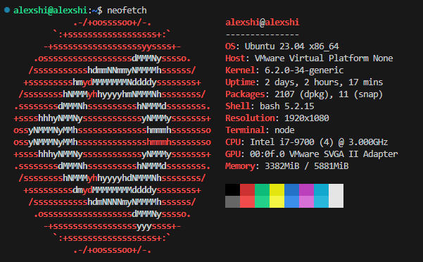
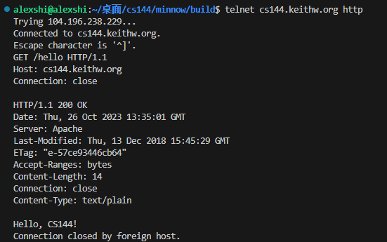
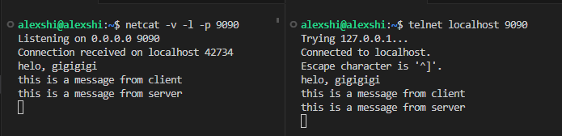
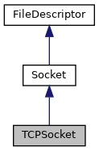
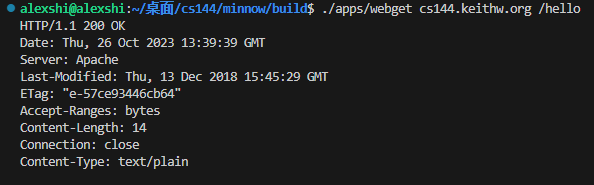
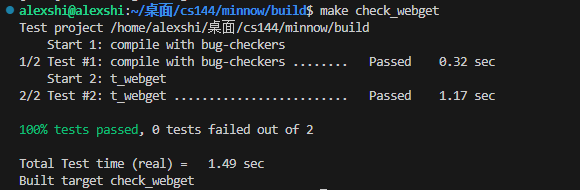
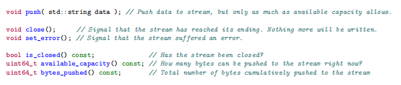
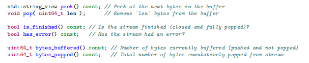
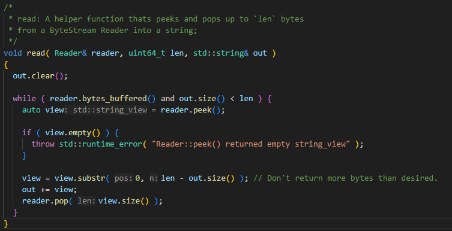
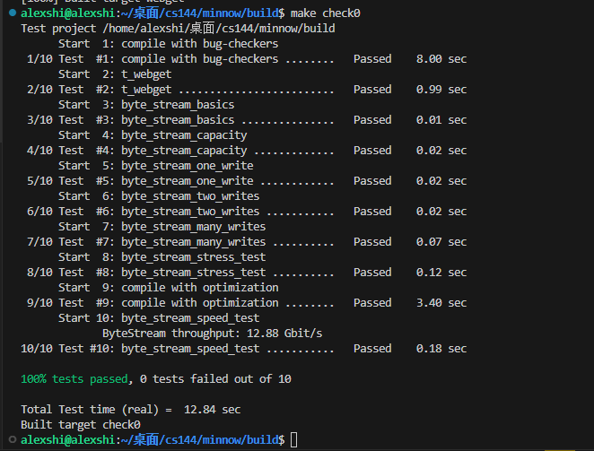

最近在学习计算机网络，注意到CS144这门课程的Lab是使用C++实现一个网络协议栈，我个人没有用Morden C++写过完整的项目，正好拿这个Lab实践，算是扎实C++的编程基础吧。
**提示，在做实验之前，请确保你已经对计算机网络，尤其是TCP/IP协议栈有基本的认识，并且了解简单的网络编程知识**（会用简单的socket api即可）。你可以从《计算机网络 自顶向下方法》、《TCP/IP协议详解》中获取到计算机网络的基础知识，网络编程部分可以看《CSAPP》中网络编程对应的章节，想了解更多关于网络编程的内容可以阅读《UNIX网络编程》。

- 课程主页 https://cs144.github.io/
- Lab0文档 https://cs144.github.io/assignments/check0.pdf
- C++文档 https://en.cppreference.com/

##### 1 Set up GNU/Linux on your computer

我的实验环境，VMware Ubuntu虚拟机，在Windows10环境下用vscode ssh remote回虚拟机开发，文档推荐使用开源的VirtualBox + Ubuntu 22.10 LTS with g++ 12.2，我觉得工具用自己顺手的就行，注意版本别弄错。然后 compiler要支持C++20标准，以及系统需要安装一些实验相关的packet：

```bash
sudo apt update && sudo apt install git cmake gdb build-essential clang \

clang-tidy clang-format gcc-doc pkg-config glibc-doc tcpdump tshark
```

<!--  -->



##### 2 Networking by hand

###### 2.1 Fetch a Web page

这部分的任务涉及到telnet，没了解过的可以了解一下 https://zh.wikipedia.org/zh-cn/Telnet ，主要工作就是telnet远程访问cs144.keithw.org主机，请求服务器上的一个网页，这部分跟着文档一步一步来就行，需要注意的是Type那几个命令的时候手速快一点，不然会超时。到后面会用程序实现这个过程。



###### 2.3 Listening and connecting

这任务是在本地，模拟客户端和服务器建立通信的过程。

```bash
netcat -v -l -p 9090
```

这条命令的作用是在你的本机启动netcat程序，在9090端口监听来自其他主机的请求，相当于一个server

```bash
telnet localhost 9090
```

使用telnet客户端建立到本机的9090端口的连接，连接成功之后就能与9090端口上的netcat服务器进行交互了。



##### 3 Writing a network program using an OS stream socket

这部分要求我们利用Linux内核提供的Socket API，编写一个名为**webget**的应用程序，其实就是自动化 fetch a web page 中手动的工作。不过多介绍，仔细看文档即可。


###### 3.1 Let’s get started—fetching and building the starter code

按照文档一步一步来即可。

课程Git仓库： https://github.com/CS144/minnow

###### 3.2 Modern C++: mostly safe but still fast and low-level

文档告诉我们，要使用morden C++风格来完成代码编写，所以你最好了解C++11之后的基础知识。
这里我列举几个注意事项

- 不要使用`malloc`、`free`、`new`、`delete`这些手动管理动态资源的关键字。
- 不要使用原始指针 `*` ，如果有必要的情况只允许使用智能指针。
- 不要使用C风格的字符串，用`std::string`代替
- 在函数中传递参数优先选用const &（避免不必要的拷贝操作）
- cmake --build build --target tidy ，使用Clang-Tidy检查项目代码确保符合代码规范以及最佳实践
  cmake --build build --target format ，格式化代码，统一风格

###### 3.3 Reading the Minnow support code

课程代码提供的类只是封装了C库函数，我们需要阅读`util/socket.hh`和`util/file descriptor.hh.`的公共接口部分来实现webget。提示：**Socke是一个FileDescriptor，而一个TCPSocket是一个Socket**



###### 3.4 Writing webget

实现get_URL函数这部分只要认真看那几个接口就能写出来，应课程要求不会贴出源码。
几个需要注意的地方

- 在HTTP中，每行结束是\r\n，仅仅\n或者enl是不够的
- 发出的message需要包含`Connection: close`，参考之前的fetch web page过程
- 在socket到达EOF之前，要打印所有的输出，也就是说只调用一次read()是不够的
- 实现功能大概需要10行

**测试：** 项目目录下 cd bulid，进入build，然后make构建项目。

```bash
./apps/webget cs144.keithw.org /hello
```

运行webget程序看看和fetch web page那里输出是否相同，网络不好的话多试几次（全程科学上网）
正确运行示例：



接下来可以进入测试了

```bash
make check0
```

测试成功示例：



##### 4 An in-memory reliable byte stream

这部分我们要实现一个内存中的双向字节流的类，这个字节流对象提供了一种在单台计算机内模拟可靠字节流的方式，可以用于处理可靠的数据流，而不需要考虑并发写入和读取、锁定或竞争条件。容量限制了内存中保存的字节数，但不限制流的长度。

需要我们实现的接口：





../src/byte_stream_helpers.cc：



简单讲一下思路：从`byte_stream_helpers.cc`中看出bytestream保存的其实是string_view，最后用peek返回的view来操作pop，结合bytestream的特点，我们可以维护一个双端队列std::deque\<std:string_view>，而string_view是一个字符串视图，并不真正拥有一个字符串，所以我们还需要维护一个std::deque\std::string>。为了完成文档结尾提到的性能，其实需要使用C++的**移动语义**来优化，不过可以先实现功能，性能后面再优化。

    If all tests pass, the check0 test will then run a speed benchmark of your implementation.
    Anything faster than 0.1 Gbit/s (in other words, 100 million bits per second) is acceptable
    for purposes of this class. (It is possible for an implementation to perform faster than 10
    Gbit/s, but this depends on the speed of your computer and is not required.)

实验文档中提到了目标性能，鉴于墙国特殊的网络环境，建议多测几次。

```bash
cd build
make check0
```

我的测试结果：



Lab0是一些热身的内容，各位仔细阅读文档不难完成。
