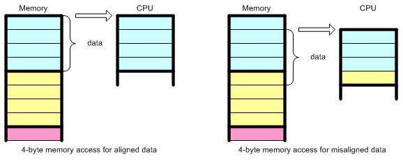
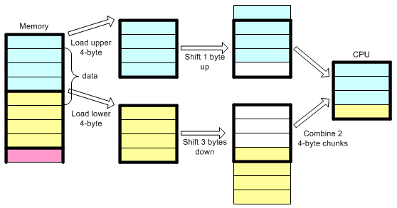

#### what

在编程语言中，数据对象（变量）有两个属性：它的值和它的地址。数据对齐是指数据的地址可以被1、2、4或8整除。换句话说，数据对象可以具有1字节、2字节、4字节、8字节的对齐，或者是2的幂次方。例如，如果一个数据的地址是12FEECh（十进制为1244908），那么它是4字节对齐，因为该地址可以被4整除。（你可以将它除以2或1，但4是可被整除的最大数。）

#### why

CPU不会每次从内存中读取或写入一个字节。相反，CPU 一次以 2、4、8、16 或 32 字节块的形式访问内存。这样做的原因是性能 ，访问 4 字节或 16 字节边界上的地址比访问1字节边界上的地址快得多。

下图说明了 CPU 如何以 4 字节内存访问粒度访问 4 字节数据块。



如果数据未对齐 4 字节边界，CPU 必须执行额外的工作来访问数据：加载 2 个数据块，移出不需要的字节，然后将它们组合在一起。这个过程肯定会降低性能并浪费 CPU 周期，只是为了从内存中获取正确的数据。



#### 直观的例子

对于struct、union或类对象中的成员数据来说。它们的成员变量必须与任何成员变量大小的最高字节对齐，以防止性能损失。例如，如果结构中有 1 个 char 变量（1 字节）和 1 个 int 变量（4 字节），编译器将在这两个变量之间填充 3 个字节。因此，该结构体变量的总大小为 8 个字节，而不是 5 个字节。通过这样做，该结构体数据的地址可以被4整除。这称为结构体成员对齐（Structure Member Alignment）。当然，结构体的大小会因此而增加。

```c
// 32位系统
struct {
	char i;    // 偏移量0，填充 3 个byte
	int  j;    // 偏移量4，总大小为8-Byte
}
```

EOF
