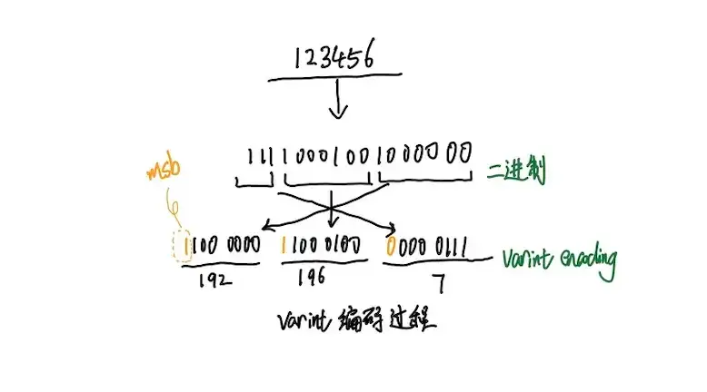

### 编码与解码

人与人之间可以使用自然语言或者文字进行交流，但是计算机只能处理二进制数字，所以人类要和计算机之间交互更容易些，编码和解码是必要的手段。

### 大小端字节序

谈到计算机的数据存储，字节序（[Endianness](https://en.wikipedia.org/wiki/Endianness)）是一个绕不开的话题。它描述了计算机如何组织字节，组成对应的数字。

计算机电路先处理低位字节，这样效率比较高，计算都是从低位开始的。所以，计算机的内部处理都是**小端字节序**。但是，人类还是习惯读写**大端字节序**。所以，除了计算机的内部处理，其他的场合几乎都是大端字节序，比如网络传输和文件储存。

计算机处理字节序的时候，不知道什么是高位字节，什么是低位字节。它只知道按顺序读取字节，先读第一个字节，再读第二个字节。如果是大端字节序，先读到的就是高位字节，后读到的就是低位字节。小端字节序正好相反。

处理器读取外部数据的时候，必须知道数据的字节序，将其转成正确的值。然后，就正常使用这个值，完全不用再考虑字节序。即使是向外部设备写入数据，也不用考虑字节序，正常写入一个值即可。外部设备会自己处理字节序的问题。

来自： https://www.ruanyifeng.com/blog/2016/11/byte-order.html

### leveldb为什么要编码和解码

LevelDB进行编码解码的主要原因是为了实现数据的高效存储和检索。具体来说，有以下几个方面的考虑：

1. **节省存储空间**：通过编码，LevelDB可以将数据压缩到更小的空间进行存储。例如，LevelDB使用变长编码可以有效地减少对小整数的存储空间需求。
2. **提高数据读写速度**：编码后的数据更小，因此在磁盘I/O操作中可以更快地读取和写入数据。
3. **统一数据格式**：LevelDB中的所有数据项都是**字符串**，无论是键还是值。因此，**对于非字符串类型的数据，如整数、浮点数等，需要进行编码转换为字符串进行存储，读取时再进行解码**。
4. **支持排序**：LevelDB的一个重要特性是它支持按键排序的数据访问。为了实现这一点，LevelDB需要对键进行编码，以便在存储和检索时保持正确的排序顺序。

### leveldb编码解码解读

leveldb为了便于操作，使用小端字节序编码，并存放在对应的字符串中，我们来看一看它的具体实现。

#### 32位int定长数值编码

```cpp
void PutFixed32(std::string* dst, uint32_t value) {
  char buf[sizeof(value)];
  EncodeFixed32(buf, value);
  dst->append(buf, sizeof(buf));
}
```

leveldb编码的过程是在存储数据时发生的。整个过程将一个32位（或者说4字节）的无符号整数（`uint32_t value`）编码并添加到一个字符串（`std::string* dst`）的末尾。编码的过程是通过`EncodeFixed32`函数完成的，编码后的结果存储在`buf`数组中，然后被追加到`dst`字符串的末尾。

```cpp
inline void EncodeFixed32(char* dst, uint32_t value) {
  uint8_t* const buffer = reinterpret_cast<uint8_t*>(dst);

  buffer[0] = static_cast<uint8_t>(value);
  buffer[1] = static_cast<uint8_t>(value >> 8);
  buffer[2] = static_cast<uint8_t>(value >> 16);
  buffer[3] = static_cast<uint8_t>(value >> 24);
}
```

编码的过程是将一个32位无符号整数（`uint32_t value`）编码为一个字节序列，并将这个字节序列存储在一个字符数组中（`char* dst`）。

**reinterpret_cast** 将`char*`类型的指针转换为`uint8_t*`类型的指针。这样做的目的是为了能够以字节为单位操作内存。`uint8_t`是一个无符号8位整数类型，也就是一个字节，所以`uint8_t*`类型的指针可以用来访问内存中的单个字节。

buffer[1] = static*cast<uint8_t>(value >> (8 * i))
这是将一个32位的无符号整数按照**小端字节序**编码为字节序列的过程。`value >> (8 _ i)`是将整数右移`(8 \* i)`位，然后`static_cast<uint8_t>`将结果转换为一个字节。目的是为了取出整数的每一个字节。

读这段源码的时候，我在想原来代码还可以这样写~

#### 32位变长数值编码

常见的方法是用4个或8个字节来存储32位或64位的整数，就像前面提到的定长编码一样，它是把原来的二进制字符串按照小端字节序放到一个新的内存空间里。但是对于用4字节或8字节表示的无符号整数，如果数值很小，那么高位的字节基本都是0，比如uint32类型的128，它的高位有3个字节都是0。如果我们能找到一种方法，把高位为0的字节去掉，只保留有效的位数，对于**较小的数值，使用的字节更少**，就可以**减少占用的字节数**，**节省存储空间**。Google的一个开源项目**Protobuf**就实现了这个想法，并提出了一种变长编码方式——**varint**。

varint是一种将整数用1个或多个字节表示的一种序列化方法，其编码后的字节序也采用小端模式，即低位数据在前，高位数据在后。varint将实际的一个字节分成了两个部分，最高位定义为MSB（most significant bit）



图中对数字123456进行varint编码，123456用二进制表示为`1 11100010 01000000`，每次低从向高取7位再加上最高有效位变成`1100 0000` `11000100` `00000111` 所以经过varint编码后123456占用三个字节分别为`192 196 7`。

解码的过程就是将字节依次取出，去掉最高有效位，因为是小端排序所以先解码的字节要放在低位，之后解码出来的二进制位继续放在之前已经解码出来的二进制的高位最后转换为10进制数完成varint编码的解码过程。

来自 https://segmentfault.com/a/1190000020500985

```cpp
void PutVarint32(std::string* dst, uint32_t v) {
  char buf[5];
  char* ptr = EncodeVarint32(buf, v);
  dst->append(buf, ptr - buf);
}
```

`PutVarint32`将一个32位无符号整数（`uint32_t v`）编码为Varint32格式，然后将其添加到一个字符串（`std::string* dst`）的末尾。

重点是实现编码的函数

```cpp
char* EncodeVarint32(char* dst, uint32_t v) {
  // Operate on characters as unsigneds
  uint8_t* ptr = reinterpret_cast<uint8_t*>(dst);
  static const int B = 128;
 
  if (v < (1 << 7)) {
    *(ptr++) = v;
  } else if (v < (1 << 14)) {
    *(ptr++) = v | B;
    *(ptr++) = v >> 7;
  } else if (v < (1 << 21)) {
    *(ptr++) = v | B;
    *(ptr++) = (v >> 7) | B;
    *(ptr++) = v >> 14;
  } else if (v < (1 << 28)) {
    *(ptr++) = v | B;
    *(ptr++) = (v >> 7) | B;
    *(ptr++) = (v >> 14) | B;
    *(ptr++) = v >> 21;
  } else {
    *(ptr++) = v | B;
    *(ptr++) = (v >> 7) | B;
    *(ptr++) = (v >> 14) | B;
    *(ptr++) = (v >> 21) | B;
    *(ptr++) = v >> 28;
  }
 
  return reinterpret_cast<char*>(ptr);
}
```

它的实现思路主要是这样：

1. 对于32位整数，如果整数小于128（即小于2的7次方），那么可以用一个字节来表示。
2. 如果整数大于等于128但小于16384（即小于2的14次方），那么可以用两个字节来表示。
3. 以此类推，如果整数越大，需要的字节就越多，最多需要5个字节。

中间那一坨位移操作的目的是将`v`的值分解为一系列7位的数字，并将这些数字存入`ptr`指向的内存。在存入内存时，如果还有更高位的数字，那么在存入的数字的最高位添加一个标记（即和128进行或运算）。这样，当读取这个内存时，如果看到一个字节的最高位是1，那么就知道还需要继续读取下一个字节。

EOF
