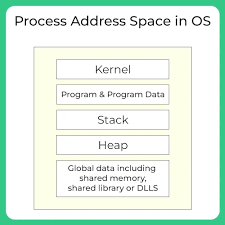
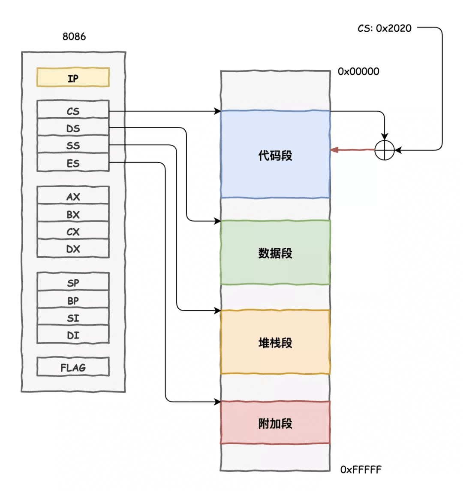
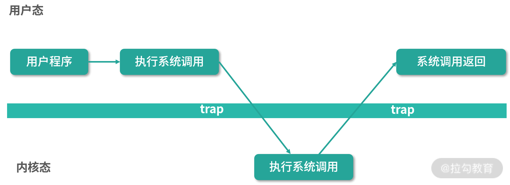

### 初学者和大师的日常对话

**初学者:** 嗨，我听说过虚拟内存和内存管理，但我不太明白它们是什么，以及为什么它们如此重要。

**大师:** 非常好的问题！虚拟内存和内存管理是计算机操作系统的核心概念之一。

**大师:** 当你运行一个程序时，它需要存储在内存中以便计算机能够执行它。虚拟内存是一种技术，它使得操作系统能够将程序的一部分存储在硬盘上，而不是全部都加载到物理内存中。这意味着你可以运行比物理内存更大的程序。

**初学者:** 那么，为什么不直接将所有程序加载到物理内存中呢？

**大师:** 好问题！物理内存是有限的资源，而程序通常比内存大得多。如果我们总是要求将整个程序加载到内存中，那么只有少数程序可以运行，而且会有很多浪费。虚拟内存允许多个程序共享有限的内存，并根据需要将它们从硬盘加载到内存中。

**初学者:** 那么内存管理是什么呢？

**大师:** 内存管理是指操作系统如何有效地分配、使用和释放内存资源的过程。它确保不同程序不会互相干扰，同时也要确保内存资源得到充分利用。操作系统需要跟踪哪些部分的内存是已分配的，哪些是空闲的，以及如何分配内存给不同的程序和进程。

**初学者:** 这听起来很复杂。操作系统是如何管理内存的？

**大师:** 操作系统使用各种技术来管理内存，包括虚拟内存、分页和分段。它会将物理内存分成小块，然后将程序的虚拟地址映射到这些物理块上。它还会跟踪哪些内存块被使用，哪些没有被使用，以便在需要时分配给新的程序。内存管理还包括内存保护，以确保一个程序不能访问其他程序的内存。

**初学者:** 好的，现在我更明白了。虚拟内存和内存管理是为了更有效地使用有限的内存资源，确保程序可以安全地运行。

**大师:** 正是如此！这两个概念是操作系统中非常关键的，它们使得计算机能够同时运行多个程序，而不会导致内存不足或程序之间的冲突。

### 早期系统的样子

从内存来看，在早期的计算机世界，根本就没有存储器抽象，每一个程序都直接访问物理内存，而操作系统实际上是一个库，那个时候操作系统的开发人员生活确实很容易。

由于机器价格昂贵，用户们就开始多人共享一台计算机，多个程序在给的定时间准备运行，当一个进程等待I/O被阻塞，操作系统切换到另一个进程开始执行，这样增加了CPU的利用率，毕竟时间就是金钱，效率决定一切。这就是**多道程序系统时代**。

很快，计算机用户对机器的要求更高，人们意识到批量计算的的局限性，对于需要用户交互或即时反馈的应用程序，批量计算不适用，用户需要等待批量任务完成后才能获得结果，这可能会降低用户体验（尤其是程序员本身）。**分时系统的时代**诞生了。

想象有很多人坐在一家餐厅里，每个人都想点菜吃饭。现在，餐厅的规则是，每个人只能一次点一道菜，然后等一段时间才能再点。这样，每个人都有机会点菜，但不会一次性占用所有厨房资源。在时分共享系统中，计算机就像那家餐厅的厨房，有很多用户想要使用它来完成各种任务，比如运行程序、浏览网页等。计算机会把时间分成很小的片段，每个片段都给不同的用户使用。这意味着用户可以交替使用计算机，就像轮流点菜一样。

随着时分共享系统的流行，人们对操作系统又有了新的要求。特别是多个程序同时驻留在内存里，这使得保护成为一个重要的问题，人们不希望一个进程的内存访问其他进程的内存，更不要说修改了。

因此操作系统需要提供一个易于使用的物理内存抽象，这就是接下来要介绍的**地址空间**。

### 抽象——地址空间

在计算机科学界有这样一句名言：**”Any problem in computer science can be solved by another layer of indirection.”** （“计算机科学中没有什么是不能通过增加一层抽象解决的”）。

地址空间（address space），是运行时的程序所看到的系统中的内存，它是操作系统提供的最基本的内存抽象。



一个进程的地址空间包含了运行的程序的所有内存状态，简单来说大致包括三个部分：code、stack、heap。程序的代码一定在内存中，在CPU眼里，它是一堆指令，CPU负责无情的执行它，当程序执行的时候，stack保存当前函数的调用信息，分配空间给局部变量，传递参数和函数返回值，heap用来管理动态分配的，用户管理的内存（我们在C/C++中new出来的内存）。其实地址空间中还包括一些静态初始化的变量，不过现在不必考虑他们。

还记得你曾经在C语言课上写过的打印指针地址的程序吗？

```c
#include<stdio.h>
#include<stdlib.h>
int main(int argc, char *argv[]) {
    printf("location of code : %p\n", (void *) main);
    printf("location of heap : %p\n", (void *) malloc(1));
    int x = 3;
    printf("location of stack: %p\n", (void *) &x);
    return 0;
}
```

上面的代码在64位的Ubuntu Liunx系统中得到以下输出：

`location of code : 0x55fec9656189`

`location of heap : 0x55fecb6526b0`

`location of stack: 0x7ffd8a00c914`

从这里我们可以看到，code在地址空间的开头，然后是heap，而stack在这个大的地址空间的另一头。所有这些打印出的地址都是虚拟地址，程序运行时由操作系统和硬件翻译成实际存储的物理地址，然后从真实的地址获取该地址的值。

作为用户级的程序员，所看到的任何地址都是虚拟的，操作系统通过精妙的虚拟化内存技术，为用户屏蔽了复杂的底层细节，让写程序的人不必操心这个变量应该存在哪里，那个对象要存在哪里，这些事情操作系统帮我们代劳。那么操作系统是如何做的呢？接下来我们将介绍基本的运行机制。

### 机制——地址转换

我们利用了一种通用技术，被称为基于硬件的地址转换，利用这种地址转换的机制，在我们每次进行内存访问时，硬件将指令中的虚拟地址转换为数据实际存储的物理内存地址，仅仅依靠硬件也是不够的，它只是提供了底层机制提高效率，还需要操作系统的配合，来管理内存，知道内存中那些地方被占用了，哪些是空闲状态。

所有这些工作都是创造一种美丽的假象：每个程序都拥有自己私有的内存，里面存放着自己的代码和数据，这种虚拟的背后是丑陋的物理现实：许多程序其实在同一时间共享着物理内存。

#### 基于硬件的动态重定位

基于硬件的地址转换的第一次应用在20世纪50年代，它在首次出现的时分机器中引入，称为基址+界限机制，也被称为动态重定位。

**硬件支持：** 具体来说在CPU的内存管理单元（MMU）中，由两个额外的寄存器，基址寄存器和界限寄存器，这组寄存器能让地址空间放在物理内存中的任何位置，同时也保证进程只访问自己的地址空间。当进程产生内存访问操作，都被处理器通过以下方式转化成物理地址：

`physical address = virtual address + base` 。

**操作系统的问题：**

1. 我们假设进程的地址空间小于物理内存，在进程创建的时候，操作系统要为进程的地址空间寻找空闲的区域，操作系统把整个物理内存看作是一整个槽块，每个槽块标记了空闲或已用的状态，当进程创建时，操作系统检索这个数据结构——空闲列表（free list）为新的地址空间找到位置，并标记为已用，然而现实是极其复杂的，地址空间会改变，这些我们后续讨论。
2. 当进程终止的时候，操作系统也必须回收它的内存，以便分配给后续需要使用的进程。
3. 由于每个CPU只有一个基址+界限寄存器，所以在上下文切换时，操作系统需要保存进程的状态，具体来说，当操作系统决定终止当前进程运行时，必须将当前基址+界限寄存器的内存保存到内存中，例如进程控制块（PCB）中（具体来说是在操作系统的内核空间里）
4. 操作系统必须提供异常处理程序（Exception handler），例如当一个程序试图越界访问内存时，CPU会触发异常，操作系统将kill企图访问非法地址的进程。

遗憾的是，这个简单的动态重定位技术有效率低下的问题，由于我们将进程的整个地址空间都放到物理内存中，如果该进程的stack和heap之间的区域过大，这块内存区域会造成浪费，这种浪费通常被称为内部碎片（internal fragmentation）。为了避免内部碎片，我们需要更复杂的机制，更好的利用物理内存，接下来我们将基址+界限的思路稍稍泛化，得到分段（segmentation）的概念。

### 分段

分段的想法很简单，就是在MMU中引入不只一个基址和界限寄存器，而是为地址空间内的每个逻辑段分配一对，分段的机制使得一维的线性逻辑地址空间映射到不同的物理地址空间去，而物理地址空间由不同的段组成。从而避免了内部碎片的问题。

#### 硬件实现方案

现在假设有一个正在运行的进程，通过CPU来执行指令，CPU要进行寻址，逻辑地址分为两部分，一部分表示段号，另一部分表示段内的偏移量。这种逻辑地址段->物理地址段的映射关系保存在段表（segment table）中，段表中保存了两个重要的信息，一个是段的起始地址，第二个是段长度的限制。
通过段号（segment number）作为段表的索引（index），我们可以找到对应段在物理内存中的起始地址，以及它的限制，然后CPU会比对物理内存段的信息是否满足限制寄存器的限制，如果不满足，意味着这是一个非法的访问，CPU会产生异常，交给操作系统去处理，把他kill掉。（还记得C语言程序中的segment fault吗？），如果满足，将段表中的起始地址（base）加上逻辑地址第二部分的段内偏移量（offset）得到对应的一个物理地址，接下来CPU进行寻址作进一步的处理。这个过程中，段表是由操作系统提前建立的。

分段解决了一些问题，帮助我们实现了更高效的虚拟内存，不只是动态重定位，通过避免地址空间逻辑段之间的大量潜在的内存浪费，分段更好地支持稀疏地址空间，由于分段算法很简单，很适合硬件完成，这样地址转换的开销很小。还有一个好处就是代码共享，如果代码段放在单独的段中，就可能被多个运行的程序共享。

但是，在内存中分配大小不同的段会出现一些问题，首先就是**外部碎片**。由于段的大小不一致，空闲空间被割裂成各种不同的大小，因此满足内存分配请求可能会很难，该问题的解决方案是紧凑的物理内存，重新安排原有的段，与之相关的算法可能有成百上千种，包括best fit、worst fit、first fit以及buddy algorithm，但遗憾的是无论算法多么精妙，都无法完全消除外部碎片，因此好的算法只试图减小它。



### 分页

将空间切成不同长度的分片以后，空间本身会碎片化，值得考虑的另一种方法：将空间分割成固定长度的分片，在虚拟内存中，称这种思想称为分页。分页不是将地址空间分割成几个不同长度的逻辑段，而是分割成固定的大小单元，每个单元称为一**页**（page）。相应地，我们把物理内存看作是定长的槽块的阵列，叫做**页帧**（frame），每个这样的页帧包含一个虚拟内存页。

#### 页寻址机制

和前面分段机制中说到的一样，程序运行的时候，CPU会去寻址，这个地址是个逻辑地址，逻辑地址分为两块，一块是页号（page number），一块是页内的偏移（offset），页号作为一个索引（index）去**页表**（page table）中查对应的帧号（frame number），然后帧号加上偏移量就得到了对应的物理地址，CPU就可以根据物理地址进行寻址。和分段不同的是分页机制页内偏移的大小是固定的，这样硬件实现上更容易。（这里的页表（page table）是操作系统提前建立的）

目前的分页机制存在一个空间的代价问题，以及时间的开销问题。其实页表非常非常的大，比之前谈到过的基址+界限寄存器大得多，（试想一下一个64位的机器如果每页1024个字节，那么一个页表有多大？答案是 2^64 / 2^10，very huge !），由于页表如此之大，而且每个进程的页表被存储在内存中。那么我们每次进行寻址相当于进行了**两次内存访问**，一次是访问页表找到对应的物理内存地址，然后再去物理内存中操作想要的值，这样额外的内存开销是巨大的。看来如果不仔细设计硬件和软件，页表会导致系统运行速度缓慢，接下来我们来解决这些问题。

对于计算机系统而言，一般来说解决空间和时间的问题有两种办法，一种是缓存（cache）：将常用一些内容缓存到离CPU比较近的地方（还记得CPU中的L1、L2 Cache吗），一种是间接（indirection）访问：将很大的空间拆成较小的空间，后面我们会介绍到 **多级页表机制**。

#### 快速地址转换（TLB）

要想实现更加高效的分页机制，操作系统需要它的老朋友硬件来帮忙，我们增加一个叫作 **地址转换旁路缓冲存储器（translation-lookaside buffer, TLB）** 的东西在MMU中，它就是频繁发生虚拟到物理地址转换的硬件缓存（cache），对每次访问，硬件先检查TLB，如果TLB中有期望的映射，就可以直接完成转换，不用访问页表，TLB带来了巨大的性能提升，实际上它使虚拟内存成为了可能。

TLB位于CPU内部，每个TLB表项包含一对<key,balue>，它使用关联存储器实现，速度很快，并且可以并发的进行查找，由于实现代价很大，所以容量是有限的。我们把经常访问的表项放在TLB中，这样就可以提升访问速度，当CPU得到一个虚拟地址，会根据它来查看TLB，如果TLB存在key，就可以用value+offset直接得到物理地址，这样就避免了对页表的访问，当然如果出现TLB miss，也就是在表中没有查到key，这时CPU还是需要去页表中查找。当然我们在实际编程中还是可以通过某种机制来使得TLB miss尽可能的小，这是接下来要介绍的缓存的局部性原理。

#### 缓存的局部性原理

缓存呢是计算机系统中最基本的性能改进技术之一，一次又一次地用于让”最常见的情况更快“，硬件缓存背后的思想是利用指令和数据引用的 **局部性**（locality）。通常有两种局部性，空间局部性（spatial locality）和时间局部性（temporal locality），**时间局部性** 指的是在一段时间内，如果程序访问了某个数据项或指令，那么在不久的将来，程序可能会再次访问相同的数据项或指令。这种局部性的原因是程序的执行通常包括循环和迭代操作，以及对相同数据的重复使用。缓存系统利用时间局部性，将最近使用过的数据项或指令保留在高速缓存中，以便在不久的将来快速访问。**空间局部性** 指的是程序在访问某个数据项或指令时，很可能会在附近访问相邻的数据项或指令。这种局部性的原因是程序的执行通常以块（block）或者数据结构的形式进行，比如数组、矩阵、链表等，当程序访问一个元素时，它通常会访问相邻元素，因为这些元素在内存中的存储位置接近。

#### 谁来处理TLB miss

这个问题可能有两个答案，软件（操作系统）或硬件。其实这和CPU的特征有关，在x86架构的CPU，完全由硬件来处理TLB miss，早期这种硬件有复杂的指令集（CISC）。现代的计算机体系架构都是精简指令集计算机（RISC），发生TLB miss时，硬件系统会抛出异常，这会暂停当前的指令流，将特权级别升到内核模式，跳转至陷阱处理程序（trap handler），接下来操作系统的异常处理程序来处理TLB miss，查找页表中的映射关系，更新TLB中的映射，再从陷阱中返回，接着硬件会重新执行该指令。（这里涉及到操作系统用户态和内核态的相关知识）



#### 多级页表

前面说到的TLB解决的是速度上解决分页效率的问题，而 **多级页表** 是从空间上解决问题。它的基本思想很简单，首先将页表分成页大小的单元，如果整页的页表项PTE无效，就完全不分配该页的页表。追踪页表的页是否有效，使用叫做 **页目录**（page directory）的结构，页目录可以告诉你页表的页在哪里，或者页表整个页不包含有效页。

**具体流程** ：要解析虚拟地址，操作系统首先使用虚拟地址的高位来查找顶级页表，从而找到底级页表的物理地址。接下来，操作系统使用虚拟地址的中间位来查找底级页表中的页表条目，以找到虚拟地址对应的物理页框号。 最后，操作系统使用虚拟地址的低位来计算出物理地址中的偏移量，并将其添加到物理页框号中，得到最终的物理地址。

多级页表可以有效减小页表的大小，因为不是所有虚拟地址空间都需要映射到物理内存。只有在需要时，才会创建页表条目，从而节省了内存开销。通过分层的结构，只有在访问大型虚拟地址空间中的某个区域时，才会创建底级页表，而其他区域则不需要。

多级页表是一种用于管理虚拟内存的高效数据结构，通过分层的方式降低了内存开销，并提高了地址转换的效率。这种机制使操作系统能够管理大型虚拟地址空间，同时最小化了内存的占用。

### 虚拟内存 —— 机制

此前我们一直假设地址空间非常小，每个正在运行的进程的地址空间都能放入内存，现在我们想要支持许多同时运行的巨大的地址空间，大的地址空间会使得系统更加方便易用。为了达到目的，需要在内存层级上再增加一层，现代系统的硬盘（disk）能够满足我们的需求，硬盘的存储层级位于内存之下，比内存有更大的存储容量，代价是读写慢。

#### 交换空间

想要实现我们的目标，第一件事情是在硬盘中开辟一块空间，用于将不常使用的内存页面从物理内存移除出，以释放空间供更紧急需要的页面使用，使得更多的进程或任务在有限的物理内存中运行。在操作系统中叫做交换空间（swap space）。

#### 存在位

现在我们在硬盘上有了一些空间，需要在系统中增加一些更高级的机制，来支持从硬盘交换页。在内存引用过程中，硬件可能发现页（page）不在物理内存中，硬件如何判断页在不在内存中是通过页表项中的 **存在位** （present bit）确定，存在位为1，表示页在内存中，存在页为0则表示页不在内存中，访问不在物理内存中的页常常被称为 **页错误** （page fault）。

#### 页错误

页错误都是由操作系统来处理，操作系统的页处理程序（page fault handler）负责确定要做什么，如果一个页不存在，已被交换到磁盘，操作系统需要该页交换到内存中，操作系统从 **页表项** （page-table entry，PTE）中查找地址，并将请求发送到硬盘，将页读取到内存中。

**具体的处理流程：** 当TLB miss时有三种情景。第一种情况是，该页存在（present）且有效（valid）。这种情况下，TLB未命中处理程序可以简单地从PTE中获取PFN，然后重试指令，接下来TLB会命中。第二种情况目标页不在物理内存中。第三种情况是访问了一个无效页，这又可能是因为程序本身的错误引起的，硬件会捕获这个非法访问，操作系统会kill掉非法线程。

#### 内存满了怎么办

在真实物理世界中，各种各样的情况会导致内存已满或者是接近满的情况，比如运行大型程序、多任务处理、内存泄漏、过多的后台进程和服务等等。因此操作系统可能希望先交换（page out）出一个或多个页，以便为操作系统即将换入的新页面留出空间。选择哪些页面被交换的过程，叫做页面交换策略（page-replacement policy），后文中我们会简单介绍到。

### 虚拟内存 —— 策略

**页面置换算法** 是用于管理虚拟内存中的页面交换的策略。当物理内存不足以容纳所有需要的页面时，页面置换算法决定哪些页面应该被替换出物理内存，以便为新的页面腾出空间。本文只简单介绍一些常见的页面置换算法，感兴趣的读者可以自行查阅相关资料。

- 最佳（Optimal）页面置换算法

  最佳页面置换算法是一种理想化的算法，它总是选择未来最长时间内不会被访问的页面进行置换。实际上，最佳算法很难实现，因为它需要对未来的页面访问行为进行预测。但它作为一种理论基准，用于评估其他算法的性能。

- 先进先出（FIFO）页面置换算法

  FIFO 算法简单而直观，它总是选择最早进入物理内存的页面进行置换。
  问题是，FIFO 可能会导致“Belady的异常情况”，即增加物理内存时，页面错误数量反而增加。

- 最近最少使用（LRU）页面置换算法

  LRU 算法选择最近最少被访问的页面进行置换。实现 LRU 算法可能需要维护一个访问页面的顺序列表或使用一种高效的数据结构，如近似栈或近似队列。LRU 算法性能较好，但实现较复杂且需要额外的开销。

- 最近最少使用近似（Approximate LRU）页面置换算法

  为了减少 LRU 算法的实现复杂性，可以采用一些近似算法，如Clock算法或Second Chance算法。这些算法不完全模拟 LRU，但在实际情况下表现良好。

- 最不常用（LFU）页面置换算法

  LFU 算法选择最不经常被访问的页面进行置换。
  LFU 算法需要维护页面的访问计数，因此可能需要更多的开销来更新计数。

- 随机页面置换算法

  随机算法是一种简单的策略，它随机选择要被替换的页面。
  随机算法不考虑页面的访问模式，因此性能通常不如其他算法。

- 工作集页面置换算法

  工作集算法基于程序的工作集模型，它保留最近一段时间内程序活动的页面，而置换其他页面。
  工作集算法需要周期性地重计算工作集，因此实现较为复杂。
